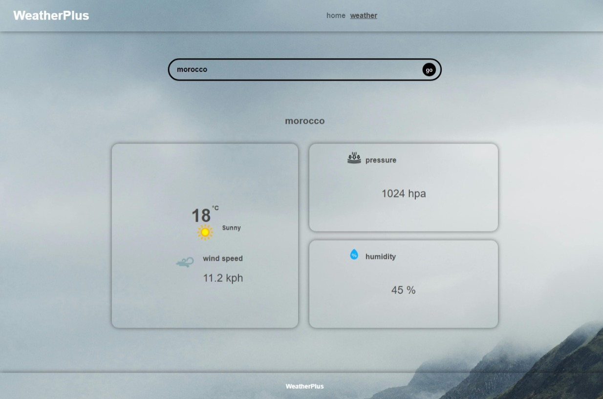
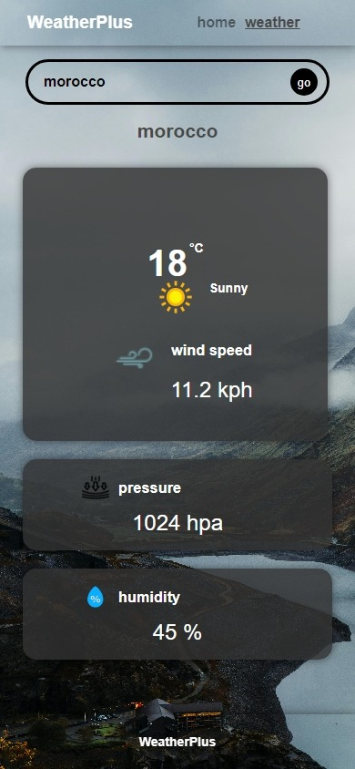
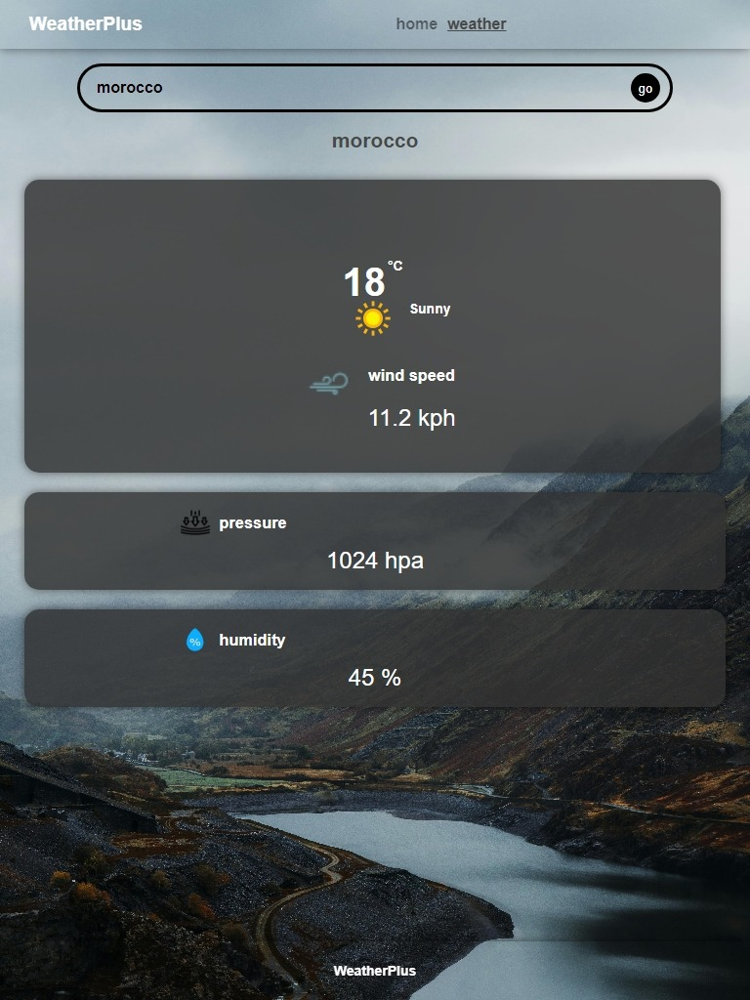

# WeatherPlus

WeatherPlus was created by a group of students from alx. We wanted to create a website that would help people plan their day based on the weather.

[deployed website](https://aplusjsdev.github.io/weather-test/#/)

## Installation

- ### First clone this repository:

```bash
git clone https://github.com/aplusJsDev/weather-test.git
```

- ### Then enter to the project directory

```bash
cd weather-test
```

- ### Install my-project with npm

```bash
npm install
```

## Run Locally

```bash
npm start
```

## Examples

- desktop screen

  

- phone screen



- tablet screen


